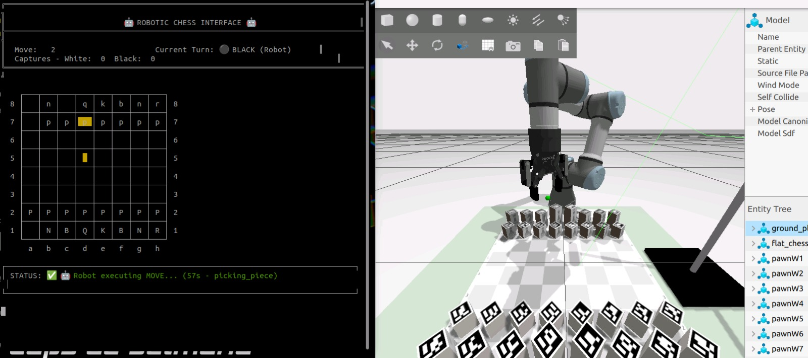

# Introduction to ROS. Final Work.
**Authors:** Sergi Romero, Sara Carles and Marina Moreno. Team 07. 2025.

This project has the objective of recreating a chess match between a human and an UR3 series robot or the robot against itself by using ROS2 communications and logic to connect all the contributing parts of the scene.

The scene consists of a chessboard with block pieces that have aruco markers on the top so they can be identified by the system through the realsense camera used and the UR Robot.

For the execution of this project the following packages have been used. Some of them have been provided to the team and some have been built or modified.

- **kinenikros2**: Provided package that computes inverse kinematics of any UR Robot.
- **robotiq_85_gripper**: Provided package that has the model and the control of the robotiq gripper.
- **robotiq_85_gripper_server**: Provided services for the robotiq gripper control.
- **tablesens**: Provided package for calibration of the realsense camera.
- **aruco_broadcaster**: Provided package that publishes and configures the transformation of the aruco frames detected.
- **chesslab_setup2**: Provided package for the setup of the chess scene in simulation and real life as well as server for basic planning services.
- **chesslab_setup2_interfaces**: Provided service interfaces of the chesslab_setup2 package.
- **final_work**: Built package that contains services and actions required to move the robot and launch the chess interface to play.

The packages that have been modified during the project are:  *chesslab_setup2* and *final_work*. All other packages have been used to call upon their services and controls. Only parameters have been modified from them to adjust the setup of the environment.

## Chess setup

The *chesslab_setup2* package is the one that provides the launch file needed to start RViz and Gazebo to run the simulated robot. It also provides a launch file to be prepared for the real robot that will be mentioned later.

### chesslab_gz.launch.py

This launch file is where all parameters and models of the elements of the simulated scene are declared.

They key elements added to this simulation are the extra declared nodes called from the *final_work* package and the *aruco_broadcaster* package.

Nodes such as *aruco_pl2_launch* from *aruco_broadcaster* to set the transformation parameters from the realsense camera to the world. These parameters are obtained through camera calibration with the *tablesens* package.

Also the *grasp_tf* node and the *action_service* node with the *move_piece_action* function from the *final_work* package which will be the ones in charge of identifying the aruco markers and their positions and calling the action services to move the chessboard pieces.

This is the command needed to start the simulation:

```
ros2 launch chesslab_setup2 chesslab_gz.launch.py launch_rviz:=true
```
This will launch:
 - A simulation in Gazebo where the UR Robot, the realsense camera, the pieces with the arucos and the chessboard can be seen.
 - A simulation in RViz with the robot and all the frames declared corresponding to the world (at the center of the chessboard), the camera, the robot links and the piece arucos.


 This will also start the services in charge of: placing the pieces, move the robot, attatch/detatch a piece and compute the inverse kinematics.

 The procedure of realisation of these services will be broken down and explained below.

## Robot movements.

 The base movement used in this project is a pick and place where the robot is indicated which piece needs to be picked (e.g. 'queenB') and where it needs to be placed (e.g. 'E4'). The positions follow the standard chess nomenclature.

### Moving a piece.

To address the movement of the robot to execute a pick and place action for a piece, an action server has been created.

The file *move_piece_action.cpp* contains the function **MovePieceActionServer** that creates the action service and calls the movement action logic **MovePieceNode**.

This action service is the one in charge of calling all the required nodes, actions and services to execute the different stages of the pick and place. This is a rundown of how it works.


**<span style="color:green">0. Goal Handling. </span>** As a previous step to the movements, the goal is checked and then accepted as goal to got though with the movements.

**<span style="color:green">1. Adding a pick frame. </span>** Once the goal is set a grasp frame is added to the piece. This step first calls on *getArucoId* to find out to which aruco the piece belongs and then with that id the function *callAddGraspFrame* is called to add a frame to the aruco so the inverse kinematics can be computed.

**<span style="color:green">2. Opening the gripper. </span>** The service to open the gripper from the *robotiq_85_gripper_server* package is called through GripperOpen.

**<span style="color:green">3. Moving to pre-pick. </span>** The robot moves to the pre-pose which is computed through the *grasp_broadcaster* node which looks up the transform from the base_link to the marker frame and then creates a pre-grasp frame by applying an offset on the z coordinate. This frame is then broadcasted for the process to use.

**<span style="color:green">4. Descent and pick. </span>** The actual pose of the piece is computed through its acuro's id and the inverse kinematics are computed to move the robot to it.

*In order to make a linear descent from pre-pick to pick a sequence of points is sent to the robot in between pick and pre-pick. Only sending the goal will make the robot descend in an arc but sending many points in-between will make the trajectory linear.

**<span style="color:green">5. Delete pick frame. </span>** The grasp frame is deleted since it is not needed anymore so the system is not overloaded with unused elements. This again is done though the *grasp_broadcaster* node.

**<span style="color:green">6. Move to pre-place. </span>** The same logic is used here as when moving to the pre-pick pose. This time instead of getting the aruco id from the piece name to know the position the nomenclature of the chessboard square is compared with a config file (*chess_board_positions.yaml*) containing the coordinates of all standard nomenclature poses. With that the inverse kinematics are computed to move the robot to the pre-place using an offset on z.

**<span style="color:green">7. Place piece. </span>** The robot moves in a linear motion to place the piece and then open the gripper using the same logic as for closing with GripperClose.

<br>

To execute this action the following commands need to be written into separate terminals:

This is the command to run the kill action once the launch file is launched with the command stated before:

```
ros2 action send_goal /move_piece final_work/action/MovePiece "{piece_name: 'queenB', square: 'A6'}"
```
This will move any piece in the chessboard to the declared position. 

Adding the parameter *-- feedback* will provide feedback in the terminal.

### Complimentary files.

For the action to work a series of complimentary files have been written to accompany its execution and ensure the running of the code.

- **action_client_node.cpp**: This node is the one that communicates with the *kinenikros2* package to send the goals (position of pieces and squares) and recieve the inverse kinematics trajectories to be made by the robot.

- **custom_graps_tf2_broadcaster.cpp**: It creates the frames needed to pre-pick and pre-place the pieces and broadcasts them. It also looks up the transform from *base_link* to the marker frame.

- **listener_node.cpp**: Does a mapping of all piece names and their corresponding arucos to be able to lookup the transform from the reference frame to the marker frame.

- **move_piece_controller.cpp**: Controls the *move_piece* sequence. Creates clients and listeners for all complimentary packages needed such as the UR Trajectory from *kinenikros2*, the gripper client to open and close it from *robotiq_85_gripper_server* and the creation of the aruco grasp frames from this package.

    It also controls parameters for the correct functioning of the movements such as declaring the different heights of the pieces, declaring waiting times so the gripper has time to open and close before the robot moves or the offsets to compensate for errors in the pick and place positions.

- **piece_ubication_node.cpp**: This node subscribes to the pose of each of the arucos or pieces and publishes them all together. To know the square that every piece occupies the Euclidean distance is computed to each of the squares from each piece and the closest square is chosen as the one the piece is currently in.

## Special chess movements.

Once the most generic movement of moving a piece was implemented the next step was to make special movement sequences for special moves in chess that were: killing a piece and castling.

### Killing a piece.

To kill a piece the sequence implemented is first moving the killed piece to a kill position declared outside of the chessboard and then put the killer piece in its position. This is a sequence of two pick and places.

For this, the same logic as the one in the sequence of moving a piece has been implemented twice.

This is the command to run the kill action once the launch file is launched with the command stated before:

```bash
ros2 action send_goal /kill_piece final_work/action/KillPiece "{killer_piece: 'queenB', killed_piece: 'pawnW8', target_square: 'A2'}"
```
Where *target_square* is the position the killed piece is currently in. This will automatically give feedback on the process.

### Castling.

In castling, the king is moved two squares toward the rook, and the rook moves past the king to the square right next to the king. Castling can be done in the king's side or the queen's side.

The process implemented here is again a sequence of two pick and places but with the addition of checking that the needed squares on the board are free and that the rook and the king are in their default positions.

This time, unlike in *kill_piece*, the logic of the movement is not implemented again, the aaction just subscribes to the original sequence of moving a piece and gets the movements from there. This way the code is cleaner and repetitions that are not needed are avoided.

This is the command to run the castling action once the launch file is launched with the command stated before:

```bash
ros2 action send_goal /castling final_work/action/Castling "{castling_type: 'kingside'}"
```
The type of action can be either 'kingside' (the short one) or 'queenside' (the long one). The argument *-- feedback* can again be added to the command to recieve feedback on the process.


## Chess interface.

With all the elements stated above now an interface can be implemented. This interface serves as game master and regulates the game. Shows the state of the board, the current turn, a historical of all the movements, etc.

The idea of this interface is to have two people playing. One with the actual pieces and one behind the robot. The "human" player will move the pieces by hand and press enter on the computer when ready and the "robot" player will insert the moves in the interface for the robot to move the pieces.

***chess_interface* node**

Upon initialising this node:
- Initialises the empty chessboard.
- Creates the action client for the move_piece action that sends the commands to the robot to move the pieces.
- Subscribes to the piece locations broadcasted through the piece ubication node which has real-time updates on the piece locations of the board.

To run this interface the following command needs to be used after executing the launch file:

```bash
ros2 run final_work chess_interface
```

Here is the interface that shows up after running the command:


With this interface the user can:

- Keep track of the movements done by themselves and the robot.
- Know how many turns have passed and whose is the current turn.
- Track the number of pieces captured.

Here is an image of the interface mid-movement where it can be appreciated that the interface gives feedback on the robot's moves and displays the piece to be moved and its goal.



## Real robot.

All shown before has been implemented with simulation first. Some tests have also been made with the real robot in order to be able to bring this into reality.

The same nodes, actions and servers have been user on the robot what differs is the launch file used.

For the real robot the file launched is called *chesslab_view.launch.py*.

This file is simillar to the launch mentioned before but has all gazebo nodes removed and the robot and gripper drivers started and it connects with the realsense camera.

In order to properly work with the robot the nodes to broadcast the position of the arucos need calibration information so the position of the camera with respect to the world needs to be given to the code.

**Calibrating the camera.**

This calibration is done following the commands:

```bash
ros2 launch tablesens aruco_realsense.launch.py
```
To launch the camera and aruco detection which are displayed in a window so that the position can be adjusted.

```bash
ros2 launch tablesens tablecalibrator.launch.py
```
To perform the calibration of the camera, this will display on the terminal the coordinates of the camera after a few seconds.

The parameters obtained are copied into the *aruco_broadcaster* launch file *aruco_pl2.launch.py*.

**Launching the file.**

With the camera calibrated the file can be launched with the command:

```bash
ros2 launch chesslab_setup2 chesslab_view.launch.py
```
This launches all the nodes and servers included in the *chesslab_gz.launch.py* file plus the robot and gripper drivers and the real camera.

With this all the actions explained earlier can be executed through another terminal or the chess interface can be used to play with the robot.
